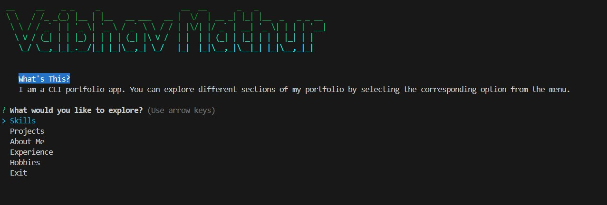

# My Portfolio

This is a command-line portfolio application built using Node.js and various npm packages. It allows users to explore different sections of my portfolio, including skills, projects, about me, experience, and hobbies.
  - 
## Installation

1. Clone the repository or download the source code.
2. Open a terminal and navigate to the project directory.
3. Run `npm install` to install the required dependencies.

## Usage

1. Start the application by running `node index.js` in the terminal.
2. Follow the prompts to explore different sections of the portfolio.

## Dependencies

This project uses the following npm packages:

- [chalk](https://www.npmjs.com/package/chalk): For styling and coloring the terminal output.
- [inquirer](https://www.npmjs.com/package/inquirer): For creating interactive command-line prompts.
- [gradient-string](https://www.npmjs.com/package/gradient-string): For creating gradient text in the terminal.
- [figlet](https://www.npmjs.com/package/figlet): For creating ASCII art banners in the terminal.
- [chalk-animation](https://www.npmjs.com/package/chalk-animation): For creating animations in the terminal.

## Features

- **Skills**: Displays a list of your skills.
- **Projects**: Showcases your projects with descriptions, links to websites, and GitHub repositories.
- **About Me**: Provides information about yourself, such as work experience, achievements, and interests.
- **Experience**: Lists your professional experience, including internships and relevant job roles.
- **Hobbies**: Highlights your hobbies and interests outside of work.

## Contributing

If you'd like to contribute to this project, please follow these steps:

1. Fork the repository.
2. Create a new branch for your feature or bug fix.
3. Make the necessary changes and commit them.
4. Push your changes to your forked repository.
5. Submit a pull request describing your changes.

